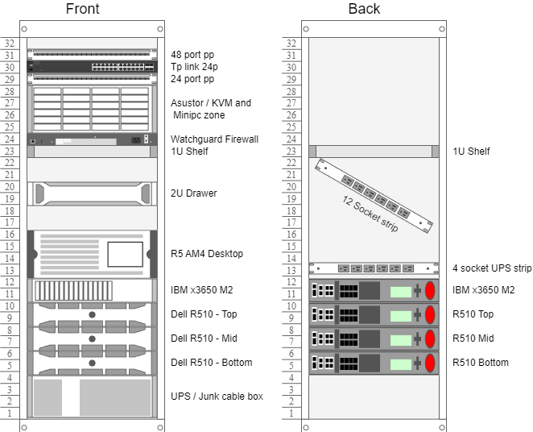

----
### Diagram - 2024-06-01

#### Front

| U Position | Device Name            | Description                         |
|------------|------------------------|-------------------------------------|
| 32         | Blank                  | Blank                               |
| 31         | Patch Panel 1          | 48-port Patch Panel                 |
| 30         | TP Link SG-SL1024DE    | 24-port managed switch              |
| 29         | Patch Panel 2          | 24-port Patch Panel                 |
| 28-24      | NAS / Minis / KVMs     | A of non-rack suited stuff          |
| 23         | WatchGuard FW          | Firebox x550                        |
| 22         | 1 U shelf              |                                     |
| 21-19      | 2 screen Blank Panel   | RPI and Old phone custom braket     |
| 19-18      | 2U junk drawer         | A whole lot of everythig            |
| 17-16      | Blank                  |                                     |
| 15-12      | 4U iStar (Nocturne)    | FreeNas Scale 14 disk box           |
| 12-11      | IBM x3650 M2 sff       |                                     |
| 10-9       | Dell R510 Top          | Currently not in use                |
| 8-7        | Dell R510 Mid          | Currently not in use                |
| 6-5        | Dell R510 Bottom       | Currently not in use                |
| 4-1        | UPS / Cable box        |                                     |

### Diagrams.net

