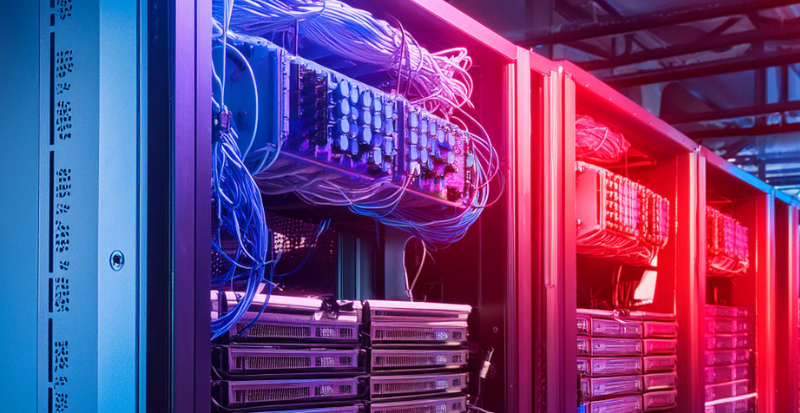

# homelab documentation

#### 01 - Introduction
- [Overview](01%20-%20Introduction/Overview.md)
- [Purpose](01%20-%20Introduction/Purpose.md)
#### 02 - Rack Layout
- [Equipment List](02%20-%20Rack%20Layout/Equipment%20List.md)
- [Rack Diagram](02%20-%20Rack%20Layout/Rack%20Diagram.md)  
#### 03 - Equipment Details  
#### 04 - Network Configuration  
#### 05 - Cable Managment  
#### 06 - Software Configuration  
#### 07 - Security Measures  
#### 08 - Maintenance Schedule  
#### 09 - Troubleshooting Logs  
